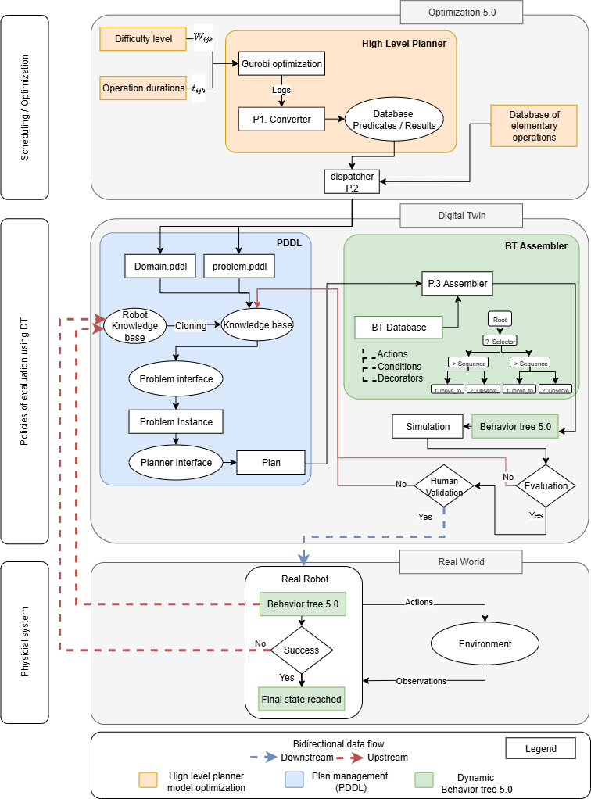

# Query-Enabled Behaviour Tree for Job Shop Scheduling

## Setup
### Using pip
#### 1. Create and activate a virtual environment

```bash
python -m venv .venv

# Linux/macOS
source .venv/bin/activate

# Windows
.venv\Scripts\activate
```

#### 2. Install the local package
``` bash
pip install -e ./core
```

### Using uv
``` bash
uv sync
```

## Running
### Run tests
#### Default

If the venv has been activated :
```bash
run-test
```

#### Using uv
```bash
uv run run-test
```

### Run the GUI
To run the test Graphical User Interface, you can execute the following command:
```bash
run-gui
```

## Architecture

The project is split into multiple packages, each responsible for either a specific stage of the pipeline or a higher-level organizational and project management role.

<center>
    
    <p>the pipeline (<a href="https://github.com/PierreHemono/Dynamic-Behavior-Tree">www.github.com/PierreHemono/Dynamic-Behavior-Tree</a>)</p>
</center>

### Core (`core/`) ([more](core/README.md))
The core package serves as the shared foundation of the project. It contains the common classes, interfaces, and utilities used to standardize behavior and data structures across all packages.

### Test (`test/`) ([more](test/README.md))
The testbed of the project

### Coordinator (`pipeline/coordinator`) ([more](pipeline/coordinator/README.md))
As the name suggests, the purpose of the coordinator is to link the difference steps together. Handle the execution order and transfer data from and to the different steps.

### Converter (`pipeline/converter`) ([more](pipeline/converter/README.md))
Processes optimization logs (`solution.sol`) and translates them into a usable format for generating the PDDL knowledge base.


### Dispatcher (`pipeline/dispatcher`) ([more](pipeline/dispatcher/README.md))
Combines translated logs with a database of elementary operations to produce `domain.pddl` and `problem.pddl` files, which are essential for high-level planning.


### Assembler (`pipeline/assembler`) ([more](pipeline/assembler/README.md))
Converts PDDL plans into executable Behavior Trees (BT).

